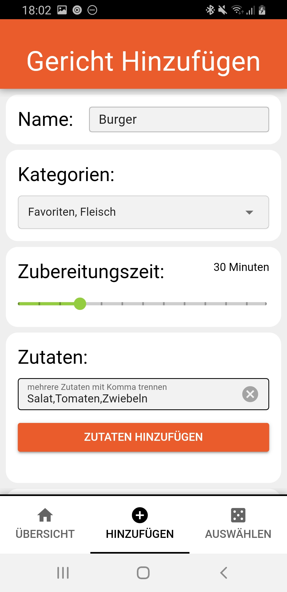
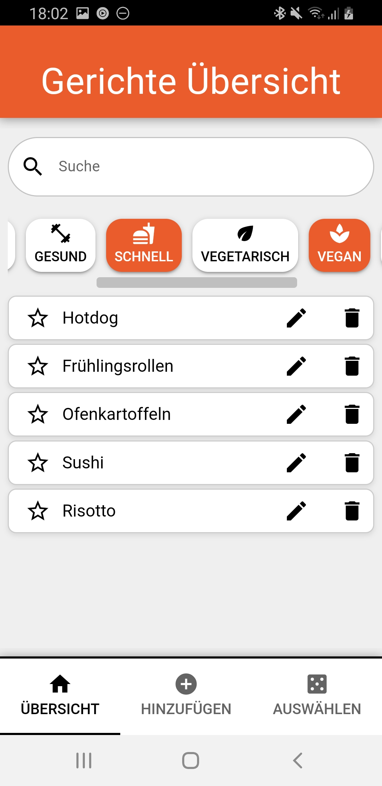
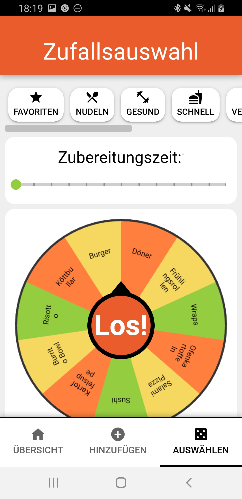

# WhatToEat
A mobile app to help you decide what's on your plate today!

## About WhatToEat
WhatToEat is a Vue application built with Quasar and Capacitor, designed as a mobile app.
Save your favorite meals and let the app help you decide what to eat when you're unsure!

## Features
* **Add & Manage Meals** – Store your favorite meals and keep track of them.
* **Meal Overview** – View all saved meals in a structured list.
* **Edit & Favorite** – Modify meals and mark your top picks with a star.
* **Random Meal Selection** – Get meal suggestions based on filters like time and category.

## Screenshots  

| Feature            | Screenshot |
|--------------------|------------|
| **Add Meal**       |  |
| **Meal Overview**  |  |
| **Random Selection** |  |
